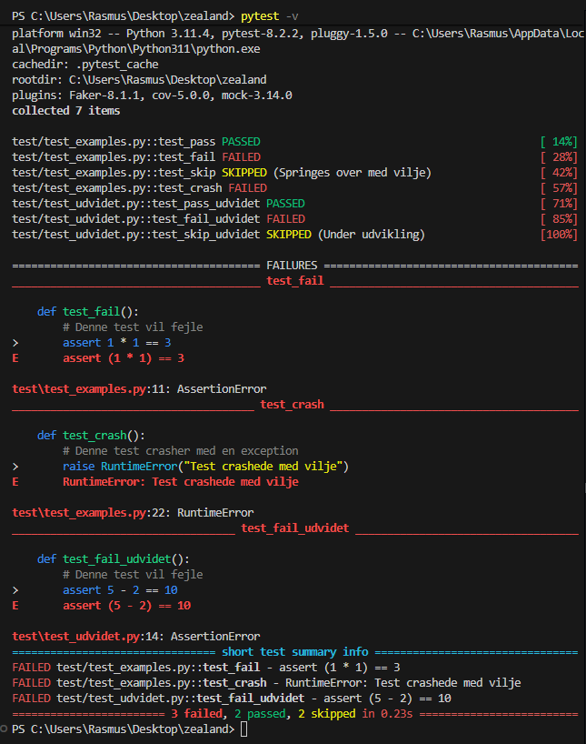
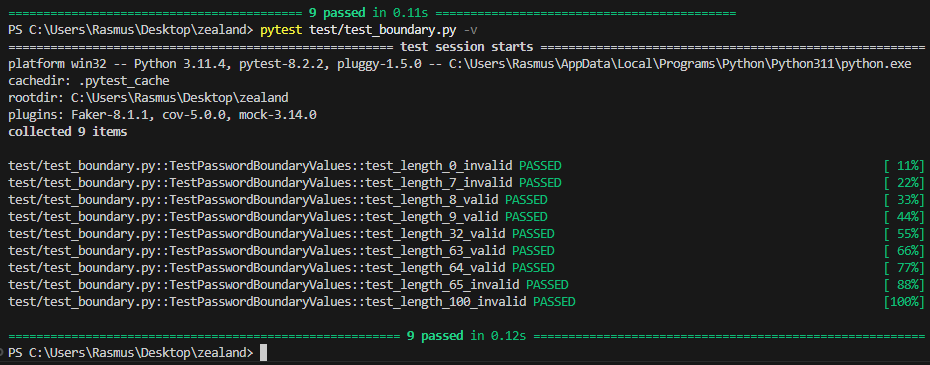
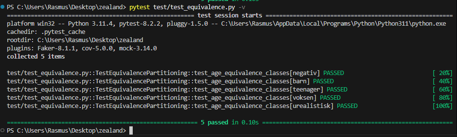
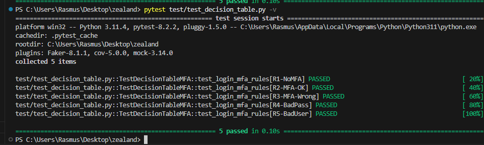
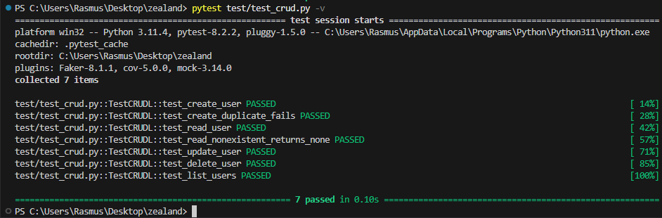
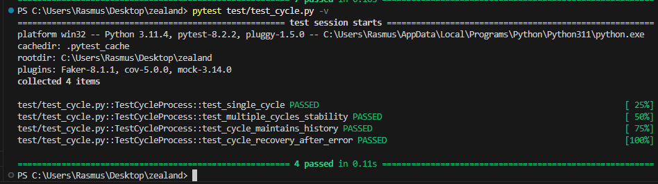

# IT_sikkerhed_1_2

Dette er et skoleprojekt til IT-sikkerhed på Zealand Næstved.

## Indholdsfortegnelse

- [Kør alle tests](#kør-alle-tests)
- [Unit Tests (03-02)](#unit-tests-03-02)
- [Grænseværditest (05-02)](#grænseværditest-05-02)
- [Test Strategier (05-02)](#test-strategier-05-02)
  - [Ækvivalensklasser](#ækvivalensklasser)
  - [Decision Table Test](#decision-table-test)
  - [CRUD(L) Test](#crudl-test)
- [Security Gates (05-02)](#security-gates-05-02)
  - [Cycle Process Test](#cycle-process-test)
- [Test Pyramiden (05-02)](#test-pyramiden-05-02)

## Kør alle tests

```bash
pytest -v
```

## Unit Tests (03-02)

Vi har lavet unit tests med pytest for at demonstrere hvordan testing fungerer.

### Test Resultater



**Alle tests kører som forventet!**

> **Bemærk:** Selvom nogle tests viser "FAILED", er dette forventet opførsel. 
> Vi har bevidst lavet tests der skal fejle for at demonstrere hvordan pytest håndterer forskellige test outcomes:
> - `test_pass` / `test_pass_udvidet` → Designet til at PASSE ✅
> - `test_fail` / `test_fail_udvidet` → Designet til at FEJLE ❌
> - `test_skip` / `test_skip_udvidet` → Designet til at blive SKIPPED ⏭️
> - `test_crash` → Designet til at CRASHE 💥

### Kør unit tests

```bash
pytest test/test_examples.py test/test_udvidet.py -v
```

## Grænseværditest (05-02)

Boundary value testing af password længde validering (8-64 tegn).

| Længde | Resultat | Type |
|--------|----------|------|
| 7 | ❌ Invalid | Grænseværdi (under min) |
| 8 | ✅ Valid | Grænseværdi (præcis min) |
| 64 | ✅ Valid | Grænseværdi (præcis max) |
| 65 | ❌ Invalid | Grænseværdi (over max) |



### Kør grænseværditests

```bash
pytest test/test_boundary.py -v
```

## Test Strategier (05-02)

### Ækvivalensklasser

Tester adgangsniveau baseret på alder (én værdi per klasse):

| Klasse | Alder | Adgang |
|--------|-------|--------|
| Ugyldig | -5 | ❌ ugyldig |
| Børn | 8 | 👶 børn |
| Teenager | 15 | 🧑 teenager |
| Voksen | 25 | ✅ voksen |
| Urealistisk | 150 | ❌ ugyldig |

```bash
pytest test/test_equivalence.py -v
```



### Decision Table Test

Login med MFA - tester alle kombinationer:

| Regel | Brugernavn | Password | MFA On | MFA OK | Resultat |
|-------|------------|----------|--------|--------|----------|
| R1 | ✅ | ✅ | ❌ | - | Adgang + Advarsel |
| R2 | ✅ | ✅ | ✅ | ✅ | Adgang |
| R3 | ✅ | ✅ | ✅ | ❌ | Nægtet |
| R4 | ✅ | ❌ | - | - | Nægtet |
| R5 | ❌ | - | - | - | Nægtet + Log |

```bash
pytest test/test_decision_table.py -v
```



### CRUD(L) Test

Create, Read, Update, Delete, List operationer på bruger database:

| Operation | Test |
|-----------|------|
| Create | Opret ny bruger |
| Read | Læs bruger data |
| Update | Opdater bruger |
| Delete | Slet bruger |
| List | List alle brugere |

```bash
pytest test/test_crud.py -v
```



## Security Gates (05-02)

Hvilke quality gates dækker vores tests:

| Test | Gate | Miljø |
|------|------|-------|
| Unit Tests | Code/Dev gate | Local/test |
| Grænseværdi | Code/Dev gate | Local/test |
| Ækvivalens | Code/Dev gate | Local/test |
| Decision Table | Integration gate | Integration |
| CRUD | Integration gate | Integration |
| Cycle Process | System/E2E gate | Staging |

### Cycle Process Test

Tester at systemet kan gentage login/logout cyklus stabilt:

| Test | Beskrivelse |
|------|-------------|
| Single cycle | Én login → action → logout |
| Multiple cycles | 10 gentagelser uden fejl |
| History | Data akkumuleres korrekt |
| Recovery | Genopretter efter fejl |

```bash
pytest test/test_cycle.py -v
```



## Test Pyramiden (05-02)

Vores tests placeret i pyramiden (bottom-up):

```
        /\
       /  \  E2E (Cycle Process)
      /----\
     /      \  Integration (CRUD, Decision Table)
    /--------\
   /          \  Unit Tests (Grænseværdi, Ækvivalens, Examples)
  /----------->\
```

| Niveau | Tests | Hastighed |
|--------|-------|-----------|
| Unit Test | Grænseværdi, Ækvivalens | 1-10ms |
| Integration | CRUD, Decision Table | 50-200ms |
| System/E2E | Cycle Process | 0.5-2min |

## Udarbejdet af

Rasmus
