# IT_sikkerhed_1_2

Dette er et skoleprojekt til IT-sikkerhed på Zealand Næstved.

## Indholdsfortegnelse

- [Kør alle tests](#kør-alle-tests)
- [Unit Tests (03-02)](#unit-tests-03-02)
- [Grænseværditest (05-02)](#grænseværditest-05-02)
- [Test Strategier (05-02)](#test-strategier-05-02)
  - [Ækvivalensklasser](#ækvivalensklasser)
  - [Decision Table Test](#decision-table-test)
  - [CRUD(L) Test](#crudl-test)
- [Security Gates (05-02)](#security-gates-05-02)
  - [Cycle Process Test](#cycle-process-test)
- [Test Pyramiden (05-02)](#test-pyramiden-05-02)
- [Flat File Database (10-02)](#flat-file-database-10-02)
- [Kryptering + Hashing (10-02)](#kryptering--hashing-10-02)
- [REST API (19-02)](#rest-api-19-02)
- [Auth API (19-02)](#auth-api-19-02)
- [Notes Microservice (26-02)](#notes-microservice-26-02)

## Kør alle tests

```bash
pytest -v
```

## Unit Tests (03-02)

Vi har lavet unit tests med pytest for at demonstrere hvordan testing fungerer.

### Test Resultater

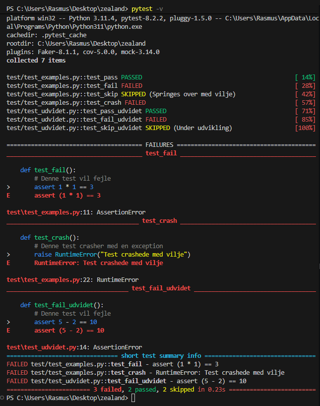

**Alle tests kører som forventet!**

> **Bemærk:** Selvom nogle tests viser "FAILED", er dette forventet opførsel. 
> Vi har bevidst lavet tests der skal fejle for at demonstrere hvordan pytest håndterer forskellige test outcomes:
> - `test_pass` / `test_pass_udvidet` → Designet til at PASSE ✅
> - `test_fail` / `test_fail_udvidet` → Designet til at FEJLE ❌
> - `test_skip` / `test_skip_udvidet` → Designet til at blive SKIPPED ⏭️
> - `test_crash` → Designet til at CRASHE 💥

### Kør unit tests

```bash
pytest test/test_examples.py test/test_udvidet.py -v
```

## Grænseværditest (05-02)

Boundary value testing af password længde validering (8-64 tegn).

| Længde | Resultat | Type |
|--------|----------|------|
| 7 | ❌ Invalid | Grænseværdi (under min) |
| 8 | ✅ Valid | Grænseværdi (præcis min) |
| 64 | ✅ Valid | Grænseværdi (præcis max) |
| 65 | ❌ Invalid | Grænseværdi (over max) |

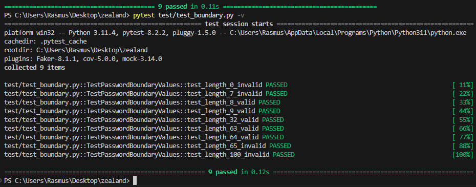

### Kør grænseværditests

```bash
pytest test/test_boundary.py -v
```

## Test Strategier (05-02)

### Ækvivalensklasser

Tester adgangsniveau baseret på alder (én værdi per klasse):

| Klasse | Alder | Adgang |
|--------|-------|--------|
| Ugyldig | -5 | ❌ ugyldig |
| Børn | 8 | 👶 børn |
| Teenager | 15 | 🧑 teenager |
| Voksen | 25 | ✅ voksen |
| Urealistisk | 150 | ❌ ugyldig |

```bash
pytest test/test_equivalence.py -v
```

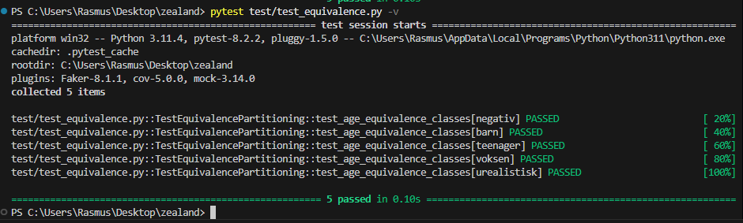

### Decision Table Test

Login med MFA - tester alle kombinationer:

| Regel | Brugernavn | Password | MFA On | MFA OK | Resultat |
|-------|------------|----------|--------|--------|----------|
| R1 | ✅ | ✅ | ❌ | - | Adgang + Advarsel |
| R2 | ✅ | ✅ | ✅ | ✅ | Adgang |
| R3 | ✅ | ✅ | ✅ | ❌ | Nægtet |
| R4 | ✅ | ❌ | - | - | Nægtet |
| R5 | ❌ | - | - | - | Nægtet + Log |

```bash
pytest test/test_decision_table.py -v
```

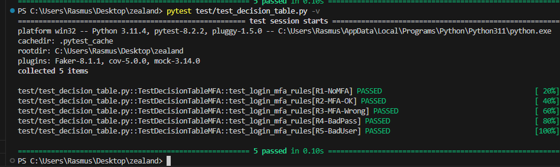

### CRUD(L) Test

Create, Read, Update, Delete, List operationer på bruger database:

| Operation | Test |
|-----------|------|
| Create | Opret ny bruger |
| Read | Læs bruger data |
| Update | Opdater bruger |
| Delete | Slet bruger |
| List | List alle brugere |

```bash
pytest test/test_crud.py -v
```

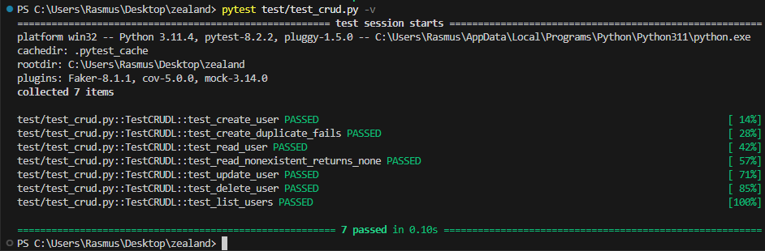

## Security Gates (05-02)

Hvilke quality gates dækker vores tests:

| Test | Gate | Miljø |
|------|------|-------|
| Unit Tests | Code/Dev gate | Local/test |
| Grænseværdi | Code/Dev gate | Local/test |
| Ækvivalens | Code/Dev gate | Local/test |
| Decision Table | Integration gate | Integration |
| CRUD | Integration gate | Integration |
| Cycle Process | System/E2E gate | Staging |

### Cycle Process Test

Tester at systemet kan gentage login/logout cyklus stabilt:

| Test | Beskrivelse |
|------|-------------|
| Single cycle | Én login → action → logout |
| Multiple cycles | 10 gentagelser uden fejl |
| History | Data akkumuleres korrekt |
| Recovery | Genopretter efter fejl |

```bash
pytest test/test_cycle.py -v
```

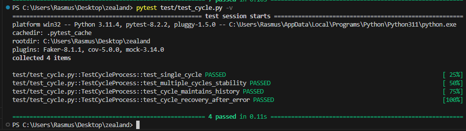

## Test Pyramiden (05-02)

Vores tests placeret i pyramiden (bottom-up):

```
        /\
       /  \  E2E (Cycle Process)
      /----\
     /      \  Integration (CRUD, Decision Table)
    /--------\
   /          \  Unit Tests (Grænseværdi, Ækvivalens, Examples)
  /----------->\
```

| Niveau | Tests | Hastighed |
|--------|-------|-----------|
| Unit Test | Grænseværdi, Ækvivalens | 1-10ms |
| Integration | CRUD, Decision Table | 50-200ms |
| System/E2E | Cycle Process | 0.5-2min |

## Flat File Database (10-02)

JSON-baseret brugerdatabase som alternativ til traditionelle databaser (MySQL, PostgreSQL).

### Hvorfor flat file DB?

- **Simpel** - Ingen database server nødvendig
- **Portabel** - En enkelt JSON-fil, nem at flytte/kopiere
- **Læsbar** - Data kan inspiceres direkte i en teksteditor
- **Letvægt** - Ingen installation, ingen konfiguration
- **Versionerbar** - Kan trackes med Git

### Begrænsninger vs. rigtige databaser

| | Flat File (JSON) | MongoDB / Supabase |
|--|-----------------|--------------------|
| Hastighed | ❌ Langsom ved mange records | ✅ Optimeret queries |
| Samtidige brugere | ❌ Ingen concurrency | ✅ Multi-user support |
| Skalerbarhed | ❌ Alt i hukommelsen | ✅ Skalerer horisontalt |
| Sikkerhed | ❌ Fil-baseret adgang | ✅ Auth + RLS policies |
| Søgning | ❌ Lineær søgning O(n) | ✅ Indexeret O(log n) |
| Brug | ✅ Prototyping, testing, små tools | ✅ Produktion |

### Database felter

| Felt | Type | Beskrivelse |
|------|------|-------------|
| person_id | int | Auto-genereret unikt ID |
| first_name | string | Fornavn |
| last_name | string | Efternavn |
| address | string | Adresse |
| street_number | int | Husnummer |
| password | string | SHA-256 hashed |
| enabled | bool | Aktiv/deaktiveret |

### Funktioner

| Operation | Metode | Beskrivelse |
|-----------|--------|-------------|
| Create | `create()` | Opret ny bruger |
| Read | `read()` | Hent bruger via ID |
| Update | `update()` | Opdater brugerfelter |
| Delete | `delete()` | Slet bruger |
| List | `list_all()` | List alle brugere |
| Search | `search()` | Søg efter felter |
| Verify | `verify_password()` | Verificér password |
| Disable | `disable_user()` | Deaktivér bruger |

### Tests (given/when/then)

Alle tests bruger given/when/then kommentarer og risikovurdering:

```python
# Given: En tom database
# When: Vi opretter en ny bruger
# Then: Brugeren er oprettet med korrekte data
# RISIKO: Kan ikke oprette brugere → systemet er ubrugeligt
```

```bash
pytest test/test_flat_file_db.py -v
```

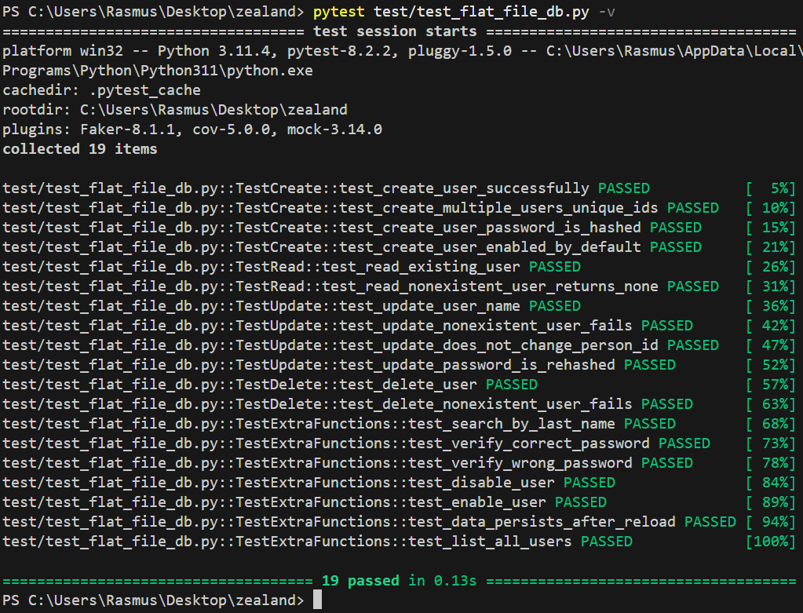

## Kryptering + Hashing (10-02)

Implementering af kryptering (AES) og hashing (SHA-256) til beskyttelse af brugerdata.

### Forskel på kryptering og hashing

| | Kryptering | Hashing |
|--|-----------|---------|
| Retning | Tovejs ↔️ | Envejs → |
| Nøgle | Kræver nøgle | Ingen nøgle |
| Kan gendannes | ✅ Ja | ❌ Nej |
| Bruges til | Persondata (navn, email) | Passwords |
| Eksempel | `"Rasmus"` → `"gAAAAABh..."` → `"Rasmus"` | `"secret"` → `"a665a..."` → kan ikke gå tilbage |

### Valg af algoritmer

**Kryptering - valgmuligheder:**

| Algoritme | Nøglestørrelse | Fordele | Ulemper | Valgt? |
|-----------|---------------|---------|---------|--------|
| Fernet (AES-128-CBC) | 128-bit | Simpel API, inkluderer IV + HMAC automatisk | Lidt langsommere pga. HMAC | ✅ Ja |
| AES-256-GCM | 256-bit | Stærkere nøgle, hurtig | Kræver manuel IV-håndtering | ❌ |
| ChaCha20 | 256-bit | Hurtig på mobil/IoT | Mindre udbredt | ❌ |

→ **Valg: Fernet** - fordi den håndterer IV, padding og HMAC automatisk. Mindre risiko for fejl.

**Hashing - valgmuligheder:**

| Algoritme | Output | Fordele | Ulemper | Valgt? |
|-----------|--------|---------|---------|--------|
| SHA-256 | 64 hex | Hurtig, simpel, standard | Ingen salt, sårbar over for rainbow tables | ✅ Ja |
| bcrypt | 60 chars | Indbygget salt, langsom (godt!) | Kræver ekstra library | ❌ |
| Argon2 | variabel | Nyeste standard, memory-hard | Kompleks opsætning | ❌ |

→ **Valg: SHA-256** - simpel til demo. I produktion bør man bruge **bcrypt** eller **Argon2** da de er designet til passwords.

### Hvornår krypteres data?

| Handling | Tidspunkt | Eksempel |
|----------|-----------|----------|
| **Kryptér** | Når data gemmes | `create()`, `update()` |
| **Dekryptér** | Kun når autoriseret bruger anmoder | `read(decrypt=True)` |
| **Fjern fra hukommelse** | Straks efter brug | `_clear_from_memory()` |
| **Hash** | Når password oprettes/ændres | `create()`, `update(password=...)` |

### Data format i JSON

```json
{
  "kunde_id": 1,
  "first_name": "<krypteret>",
  "last_name": "<krypteret>",
  "address": "<krypteret>",
  "email": "<krypteret>",
  "telefon": "<krypteret>",
  "password": "<hashed>"
}
```

### GDPR-principper i praksis

| GDPR Princip | Hvad det betyder | Hvordan det er implementeret |
|-------------|-----------------|------------------------------|
| Fortrolighed | Data skal beskyttes mod uautoriseret adgang | PII krypteres med Fernet før lagring |
| Dataminimering | Gem kun det nødvendige | Kun relevante felter gemmes per bruger |
| Integritet | Data må ikke ændres uopdaget | Fernet inkluderer HMAC der opdager ændringer |
| Ret til sletning | Brugere kan kræve deres data slettet | `delete()` fjerner al data permanent |
| Pseudonymisering | Data skal være ulæselig uden nøgle | Krypterede felter kan ikke læses uden `.key` fil |

**Nøglehåndtering**: Krypteringsnøglen gemmes i separat `.key` fil. I produktion bør den ligge i en environment variable eller HSM (Hardware Security Module).

**Memory-sikkerhed**: Dekrypteret data ryddes fra hukommelsen efter brug via `_clear_from_memory()`.

```bash
pytest test/test_encryption.py -v
```

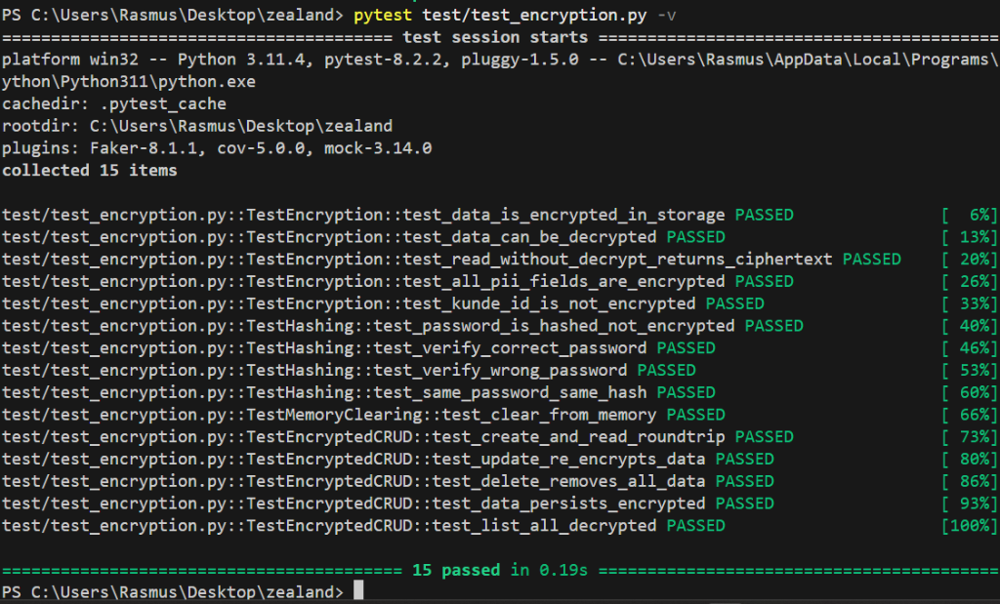

### Bcrypt Rounds Benchmark (EKSTRA)

SHA-256 blev valgt til denne implementation, men i produktion bør man bruge **bcrypt**. Hvorfor?

**Problemet med SHA-256**: Den er designet til at være hurtig → en hacker kan prøve milliarder af passwords per sekund.

**bcrypt løsningen**: Den er designet til at være **langsom**, og man kan justere med "rounds":

| Round | Iterationer | Tid per hash | Hacker forsøg/sek |
|-------|-------------|-------------|-------------------|
| 10 | 2^10 = 1.024 | ~46ms | ~22 |
| 12 | 2^12 = 4.096 | ~185ms | ~5 |
| 14 | 2^14 = 16.384 | ~700ms | ~1 |

**Middelvej**: Round 12 er standard fordi:
- **Brugeren** logger ind én gang → 185ms er usynligt
- **Hackeren** skal prøve millioner af passwords → 185ms × 1.000.000 = **2+ dage**

```bash
pytest test/test_bcrypt_benchmark.py -v -s
```

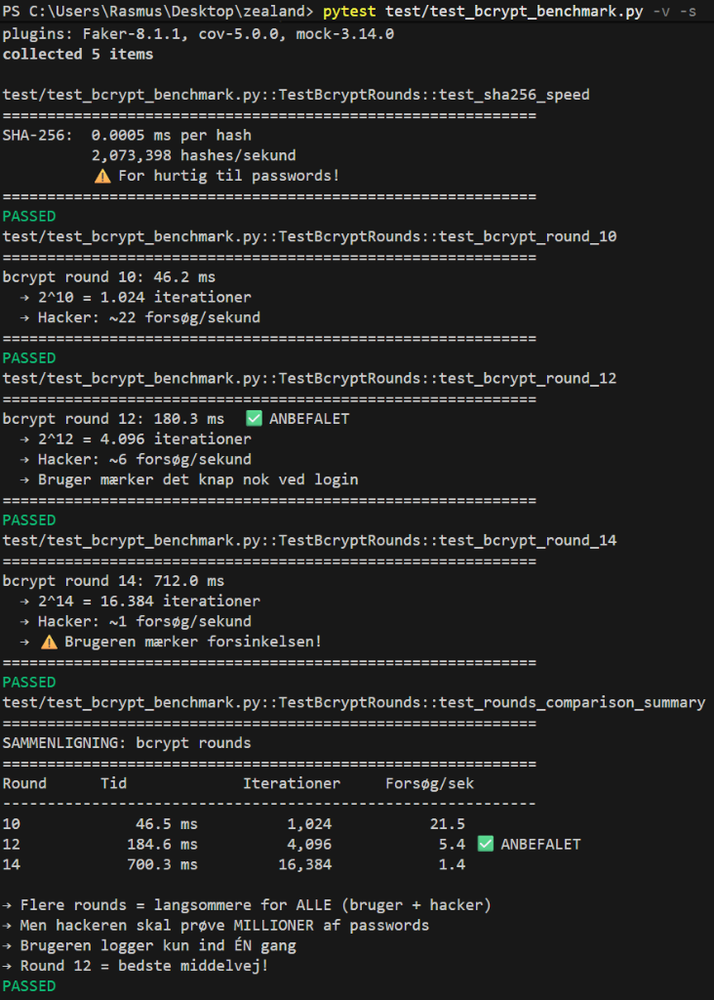

## REST API (19-02)

REST API bygget med **FastAPI** der wrapper den eksisterende flat file database.

### Hvad er et REST API?

Et REST API er en måde at tilgå data over HTTP. I stedet for at kalde Python-funktioner direkte, sendes HTTP requests (GET, POST, PUT, DELETE) til endpoints. Det gør det muligt at bygge en frontend, mobil-app eller et andet system der taler med databasen.

### Opbygning

```
HTTP Request → FastAPI (api.py) → FlatFileDB (flat_file_db.py) → users.json
```

- **FastAPI** modtager HTTP requests og validerer input med Pydantic models
- **FlatFileDB** håndterer CRUD operationer og gemmer i JSON
- **Swagger UI** auto-genereres på `/docs` til test af endpoints

### Endpoints

| Metode | Endpoint | Beskrivelse | Status Code |
|--------|----------|-------------|-------------|
| `POST` | `/users` | Opret bruger | 201 |
| `GET` | `/users` | List alle brugere | 200 |
| `GET` | `/users/{id}` | Hent bruger | 200 / 404 |
| `PUT` | `/users/{id}` | Opdater bruger | 200 / 404 |
| `DELETE` | `/users/{id}` | Slet bruger | 200 / 404 |

### Kør serveren

```bash
uvicorn api:app --reload
```

Swagger docs: [http://127.0.0.1:8000/docs](http://127.0.0.1:8000/docs)

### Tests

```bash
pytest test/test_api.py -v
```

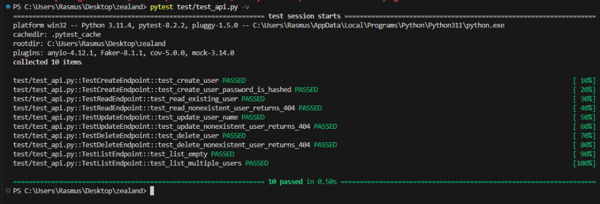

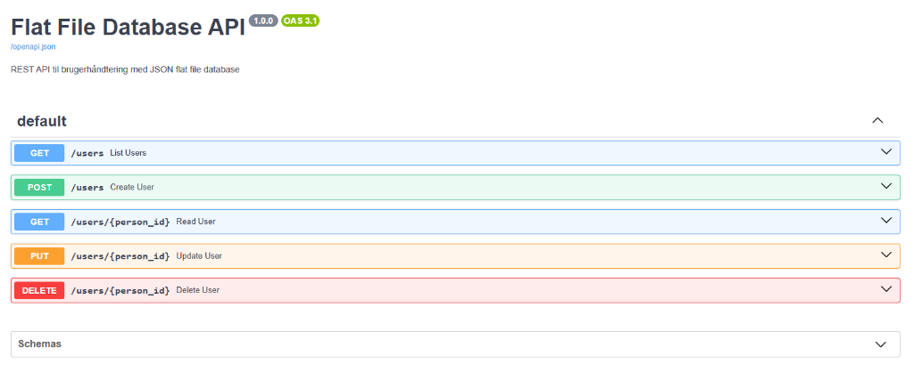

## Auth API (19-02)

Authorization REST API med **JWT security tokens** og rolle-baseret adgangskontrol.

### Hvad er bygget?

Et authentication system der håndterer brugerregistrering, login med JWT tokens og rolle-baseret adgangskontrol (`admin`/`user`). Når serveren startes uden database, oprettes automatisk en admin-bruger. Passwords hashes med HMAC-SHA256 + tilfældigt salt, og persondata (navn) krypteres med Fernet inden det gemmes.

### Opbygning

```
POST /token → AuthService verificerer password → JWT token returneres
POST /deactivate → Token verificeres → Rolle tjekkes → Bruger deaktiveres
```

- **auth_api.py** — FastAPI endpoints (register, token, deactivate, activate)
- **auth_service.py** — Password hashing (HMAC+salt), Fernet kryptering, JWT tokens
- **.env** — Test secrets (committed med vilje, se secrets håndtering nedenfor)

### Token Flow

```
1. Login (POST /token) → JWT Bearer token returneres
2. Token sendes i header → API verificerer og giver adgang
3. Token udløber efter 1 time → nyt login kræves
```

### Endpoints

| Metode | Endpoint | Auth? | Beskrivelse |
|--------|----------|-------|-------------|
| `POST` | `/register` | ❌ | Registrer ny bruger |
| `POST` | `/token` | ❌ | Login → få JWT token |
| `POST` | `/change-password` | 🔒 Token | Skift password |
| `POST` | `/deactivate` | 🔒 Token | Deaktiver konto (sig selv eller admin) |
| `POST` | `/activate` | 🔒 Token | Reaktiver konto (kun admin) |

### Roller

| Rolle | Kan deaktivere | Kan aktivere |
|-------|---------------|-------------|
| `user` | Kun sig selv | ❌ Nej |
| `admin` | Alle brugere | ✅ Ja |

### Secrets håndtering

| Miljø | Hvor secrets ligger | I git? |
|-------|--------------------|---------|
| Test | `.env` fil | ✅ Ja (bevidst) |
| Produktion | Environment variables | ❌ Nej |

### Kør serveren

```bash
uvicorn auth_api:app --reload
```

Default admin login: `admin` / `admin`

### Tests

```bash
pytest test/test_auth_api.py -v
```

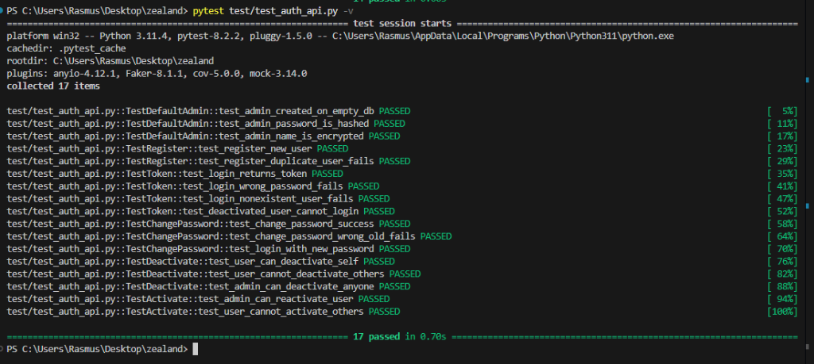

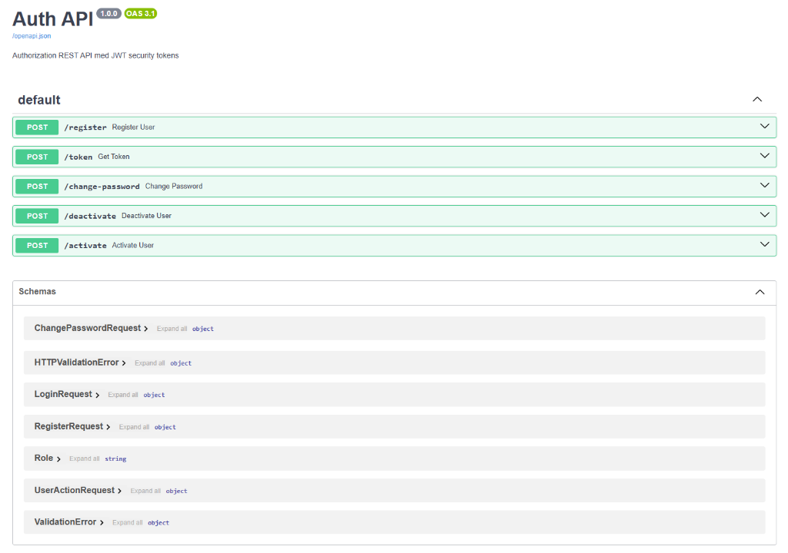

---

## Notes Microservice (26-02)

Microservice der kræver authentication fra Auth API'et. Brugere kan oprette, læse og slette egne noter - men kun hvis de har et gyldigt JWT token.

### Arkitektur

```
Bruger -> Notes API (port 8001) -> AuthService -> Verificer JWT token
               |
               v
         notes_db.json
```

Notes API'et genbruger `AuthService` til at verificere tokens. Hvis token er ugyldigt, returneres 401. Brugere kan kun se og slette deres egne noter.

### Endpoints

| Metode | Endpoint | Auth | Beskrivelse |
|--------|----------|------|-------------|
| `GET` | `/notes` | 🔒 Token | Hent egne noter |
| `POST` | `/notes` | 🔒 Token | Opret ny note |
| `DELETE` | `/notes/{id}` | 🔒 Token | Slet egen note |

### Kør serveren

```bash
uvicorn notes_api:app --reload --port 8001
```

### Test Design Teknik: Boundary Value Analysis (BVA)

BVA tester grænseværdier - de steder hvor fejl oftest opstår:

| Grænse | Test cases |
|--------|-----------|
| Token | Gyldigt, ugyldigt, manglende |
| Note title | Tom, kun mellemrum, normal |
| Note content | Tom, normal, 10.000 tegn |
| Ejerskab | Egen note, andres note |
| Note ID | Eksisterende, ikke-eksisterende |

### Tests

```bash
pytest test/test_notes_api.py -v
```

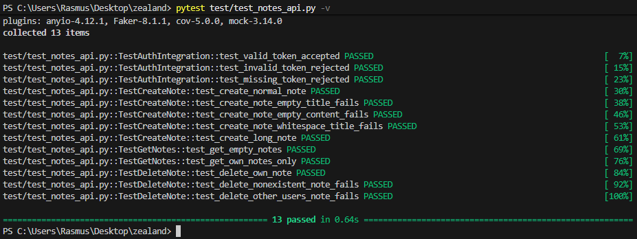

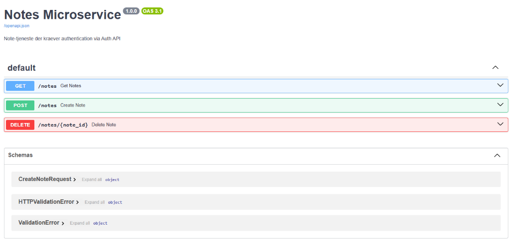

## Udarbejdet af

Rasmus
